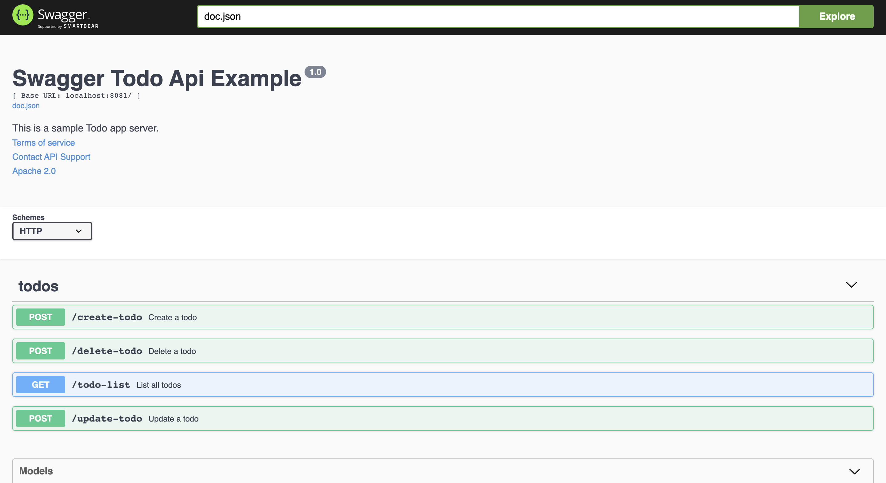

# Todos Restful Api

[

Todo-app is backend and frontend project.I developed it using backend golang and frontend it using reactjs.

You can reach ui github repo [link.](https://github.com/olucvolkan/todoApp-ui)


# Demo-Preview



# Table of contents

- [Todos](#todos)
- [Demo-Preview](#demo-preview)
- [Table of contents](#table-of-contents)
- [Installation](#installation)
- [Usage](#usage)
- [Deployment](#deployment)
- [References](#references)

# Installation
[(Back to top)](#table-of-contents)

To use this project, first clone the repo on your device using the command below:

```git init```

```git https://github.com/olucvolkan/todoApp```


# Usage
[(Back to top)](#table-of-contents)

### `build`

```sh
$ cd todoApp
$ go build main.go
$ go run main.go
```
Runs the app in the development mode.<br />
Open [http://localhost:8080/swagger/index.html](http://localhost:3000) to view it in the browser.

The page will reload if you make edits.<br />
You will also see any lint errors in the console.

### `unit test`

```sh
$ cd test && go test
```

